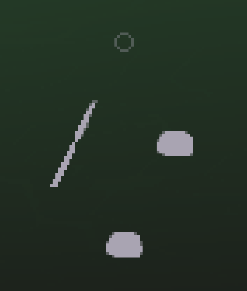
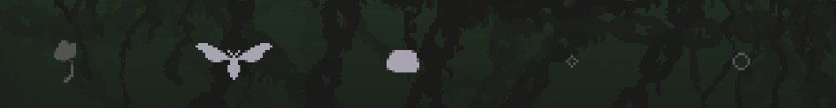
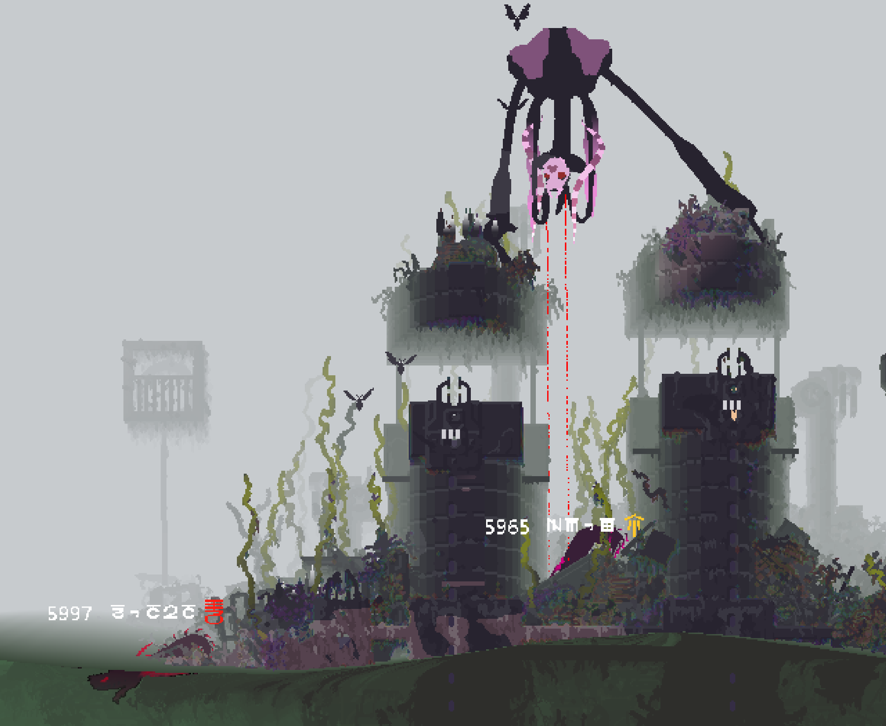
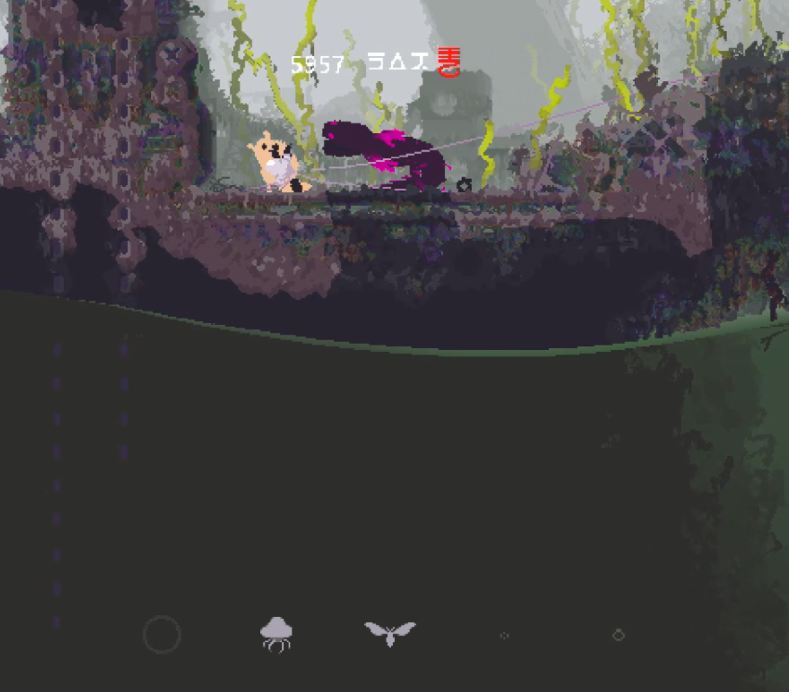
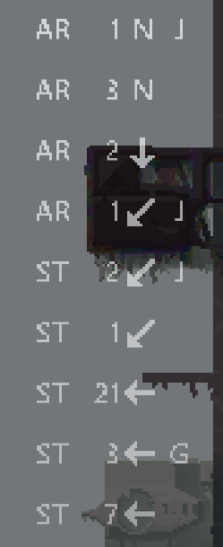

# MoreSlugHUD

雨世界 mod，添加了多项实用 HUD。

## 功能介绍

### 库存

显示当前库存（双手、腹部、背部）的物品，并显示合成结果预测。

该功能受到 [What's in My Pocket?](https://steamcommunity.com/sharedfiles/filedetails/?id=2957745837) 启发。
（事实上这个 mod 的起点就是“我想把它待办里说的合成预测做出来”，只不过后续加入了其他新的想法，才导致最终单独写了一个 mod，而不是一个 fork。衷心致谢。）

支持十字和横排两种展示方式，可自定义屏幕坐标。




### 生物标签

给特定生物（蜥蜴、拾荒者、猫崽）头顶展示编号、辨识名与意图（中立、友善与攻击）。

该功能受到 [Visible ID](https://steamcommunity.com/sharedfiles/filedetails/?id=2934997065) 启发。

辨识名：使用古代符文为生物取一个名字。我自己也不知道怎么读，但我感觉很酷。
（我本计划允许玩家自定义名称，但在着手开发此功能之前，我注意到 [Name Your Friends](https://steamcommunity.com/sharedfiles/filedetails/?id=3775963449) 出现了，并且基本能满足我设想的需求；因此最终仅保留了这个用于提供气氛的选项。）

各项目可独立切换是否展示。




### 输入历史

实时展示一个带帧数的玩家输入和运动状态的历史日志。（玩过格斗游戏的话，应该会很熟悉。）

支持在 remix 中详细配置需要展示的内容。

默认使用字母来表示各运动状态和动作，也可切换为图标。
（remix 配置面板中有图例，目前的这套图标是我手绘的，我对其并不满意，欢迎提交改进。）

我在该功能开发完成之后，才注意到类似功能已有 [Debug - Input Log](url=https://steamcommunity.com/sharedfiles/filedetails/?id=3157558337) 提供。经过考察之后，我认为我实现的效果和它提供的仍然存在差异，因此保留了该功能。



### 杂项

可在键位设置（Improved Input Config）中配置按键，以在游戏中切换面板的显示状态。
库存、生物标签无默认绑定按键；输入历史默认绑定键盘 **H**、手柄 **L3**。

联机兼容性：本地模组，不影响联机。

## 开发构建

需要在 `lib/` 中补充依赖文件: 
 - 来自 [Improved Input Config](https://github.com/zombieseatflesh7/improved-input-config) 的 `ImprovedInput.dll` 和 `ImprovedInput.xml`
 - 来自 [Rain Meadow](https://github.com/henpemaz/Rain-Meadow) 的 `Rain Meadow.dll`

在 `GamePaths.local.props` 中配置 `RWDir` 指向 Rain World 安装目录。

```xml
<?xml version="1.0" encoding="utf-8"?>
<Project>
  <PropertyGroup>
    <RWDir>D:\SteamLibrary\steamapps\common\Rain World</RWDir>
  </PropertyGroup>
</Project>
```

然后可以使用开发脚本：

```powershell
.\build.ps1          # 编译并将模组打包到 dist/
.\dev.ps1 link       # 把 dist/ 下的 mod 文件夹链接到游戏本地 mod 目录下
# 开发期间修改代码后重新运行 build.ps1
.\dev.ps1 unlink     # 开发结束后解除链接
```

### 代码结构

| 目录 | 职责 |
|------|------|
| `src/Plugin/` | Mod 生命周期与选项 |
| `src/Hud/` | HUD 挂接及通用处理 |
| `src/Inventory/` | 库存 |
| `src/Id/` | 生物标签 |
| `src/History/` | 输入历史 |
| `src/Compat/` | 兼容性处理 |
| `atlases/` | 输入历史图集 |
